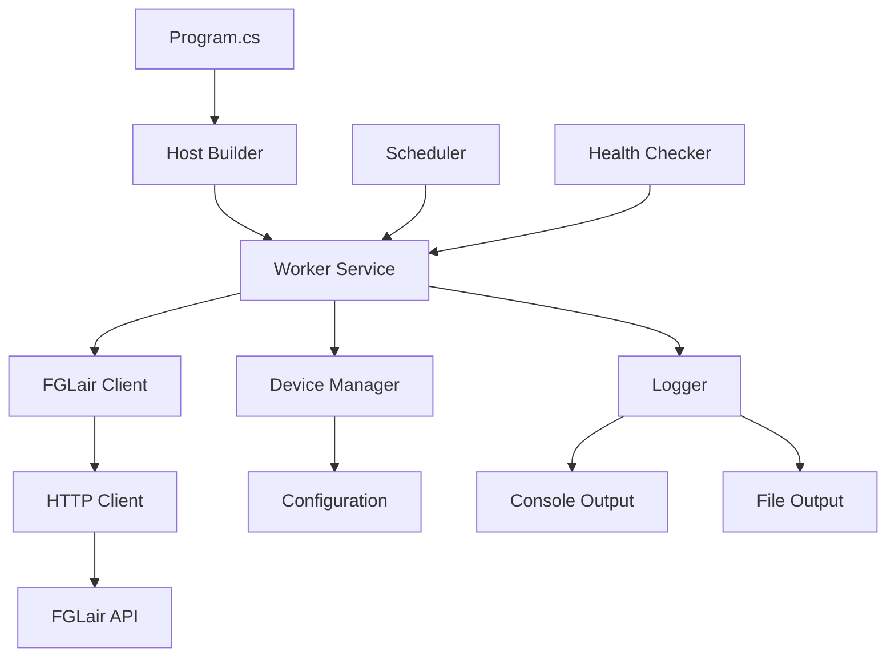

# Architecture Guide

This document describes the technical architecture, design decisions, and patterns used in the FGLair Control application.

## Overview

FGLair Control is a .NET Worker Service that provides automated control of Fujitsu General air conditioner louver positions through continuous background processing.

## Architecture Principles

### Design Goals
- **Reliability**: Robust error handling and recovery
- **Maintainability**: Clean code with clear separation of concerns
- **Testability**: Comprehensive unit and integration testing
- **Observability**: Structured logging and monitoring
- **Security**: Secure credential management and API communication

### Key Patterns
- **Dependency Injection**: Loose coupling and testability
- **Repository Pattern**: Data access abstraction
- **Factory Pattern**: HTTP client creation and management
- **Observer Pattern**: Event-driven logging and monitoring
- **Strategy Pattern**: Different deployment scenarios

## System Architecture



## Component Details

### Program.cs - Application Bootstrap
**Responsibility**: Application startup, dependency injection configuration, host setup

```csharp
// Key responsibilities:
// 1. Configure services and dependencies
// 2. Set up logging infrastructure  
// 3. Load configuration from multiple sources
// 4. Initialize and start the worker service
```

**Design Decisions**:
- Uses .NET Generic Host for proper lifecycle management
- Configures HttpClient with factory pattern for connection pooling
- Implements configuration hierarchy (appsettings → environment → command line)

### Worker.cs - Background Service
**Responsibility**: Main business logic orchestration, louver cycling management

```csharp
// Key responsibilities:
// 1. Authenticate with FGLair API
// 2. Monitor current louver position
// 3. Cycle between target positions
// 4. Handle errors and retry logic
// 5. Manage timing and scheduling
```

**Design Decisions**:
- Inherits from `BackgroundService` for proper .NET hosting
- Uses cancellation tokens for graceful shutdown
- Implements exponential backoff for transient failures
- Maintains state between cycles for position alternation

### Services Layer

#### IFGLairClient / FGLairClient
**Responsibility**: HTTP communication with FGLair API

```csharp
// Key responsibilities:
// 1. API authentication and session management
// 2. Device property retrieval and updates
// 3. HTTP error handling and retries
// 4. Request/response serialization
```

**Design Decisions**:
- Interface-based design for testability
- Typed HttpClient with proper disposal
- Automatic token refresh on expiration
- Structured exception handling

#### DeviceInfo
**Responsibility**: Device discovery and property management

```csharp
// Key responsibilities:
// 1. Device enumeration and validation
// 2. Property schema management
// 3. Device state caching
```

### Models Layer

#### Authentication Models
- `LoginRequest`: User credentials for API authentication
- `LoginResponse`: Authentication tokens and user information
- `RefreshTokenRequest`: Token renewal requests

#### Device Models
- `DeviceProperty`: Generic device property representation
- `LouverPosition`: Specific louver position data
- `DeviceStatus`: Overall device state information

## Data Flow

### Startup Flow
1. **Configuration Loading**: appsettings.json → environment variables → command line
2. **Service Registration**: Dependency injection container setup
3. **HTTP Client Setup**: Factory configuration with base URLs and headers
4. **Worker Initialization**: Background service starts
5. **Authentication**: Initial API login and token acquisition

### Runtime Flow
1. **Position Check**: Query current louver position
2. **Decision Logic**: Determine next target position (7 ↔ 8)
3. **Position Update**: Send API command to change position
4. **Verification**: Confirm position change was successful
5. **Wait Period**: Sleep for configured interval (20 minutes)
6. **Repeat**: Return to step 1

### Error Handling Flow
1. **Exception Capture**: Structured exception logging
2. **Classification**: Transient vs. permanent error determination
3. **Retry Logic**: Exponential backoff for transient errors
4. **Fallback**: Graceful degradation or service restart
5. **Notification**: Error reporting and alerting

## Configuration Architecture

### Configuration Sources (Priority Order)
1. **Command Line Arguments**: `--key=value`
2. **Environment Variables**: `FGLair__Key=value`
3. **appsettings.{Environment}.json**: Environment-specific settings
4. **appsettings.json**: Default configuration

### Configuration Model
```csharp
public class FGLairSettings
{
    public string Username { get; set; }
    public string Password { get; set; }
    public string DeviceDsn { get; set; }
    public int CycleIntervalMinutes { get; set; } = 20;
    public int[] TargetPositions { get; set; } = { 7, 8 };
    public int MaxRetryAttempts { get; set; } = 3;
    public TimeSpan RetryDelay { get; set; } = TimeSpan.FromSeconds(30);
}
```

## Logging Architecture

### Logging Strategy
- **Structured Logging**: JSON-formatted logs with consistent fields
- **Log Levels**: Appropriate use of Information, Warning, Error, Debug
- **Correlation IDs**: Request tracking across components
- **Sensitive Data**: Credential scrubbing and PII protection

### Log Categories
```csharp
// Authentication events
_logger.LogInformation("Authentication successful for user {Username}", username);

// Position changes
_logger.LogInformation("Louver position changed from {OldPosition} to {NewPosition}", 
    oldPosition, newPosition);

// API errors
_logger.LogError(ex, "API request failed for endpoint {Endpoint}", endpoint);

// System events
_logger.LogWarning("Service paused due to network connectivity issues");
```

## Security Architecture

### Credential Management
- **No Hardcoded Secrets**: All credentials from configuration
- **Environment Variables**: Production credential injection
- **Secret Scrubbing**: Automatic credential removal from logs
- **Secure Storage**: Docker secrets and key vault integration

### API Security
- **HTTPS Only**: All API communication encrypted
- **Token Management**: Automatic refresh and secure storage
- **Request Signing**: API authentication headers
- **Rate Limiting**: Respectful API usage patterns

## Testing Architecture

### Unit Testing Strategy
- **Dependency Mocking**: All external dependencies mocked
- **Test Categories**: Fast, isolated, repeatable
- **Coverage Goals**: >80% code coverage
- **Test Data**: Builders and fixtures for consistent test data

### Integration Testing Strategy
- **API Testing**: Real API endpoints with test accounts
- **Container Testing**: Docker image validation
- **End-to-End**: Complete workflow testing
- **Environment Isolation**: Separate test environments

## Deployment Architecture

### Container Strategy
- **Multi-stage Build**: Optimized container size
- **Base Images**: Microsoft official .NET runtime images
- **Security Scanning**: Container vulnerability assessment
- **Health Checks**: Container health monitoring

### Orchestration Options
- **Docker Compose**: Simple single-host deployment
- **Kubernetes**: Scalable container orchestration
- **Azure Container Instances**: Serverless container hosting
- **Docker Swarm**: Multi-host container clustering

## Performance Considerations

### Resource Usage
- **Memory**: ~50MB baseline, minimal growth
- **CPU**: Low utilization except during API calls
- **Network**: Periodic API requests, minimal bandwidth
- **Storage**: Logs only, configurable retention

### Scalability
- **Horizontal**: Multiple instances for different devices
- **Vertical**: Single instance handles one device efficiently
- **Geographic**: Regional deployment for latency optimization

## Monitoring and Observability

### Metrics Collection
- **Application Metrics**: Success/failure rates, response times
- **System Metrics**: Memory, CPU, network usage
- **Business Metrics**: Position changes, cycle completion rates

### Health Checks
- **Liveness**: Service is running and responsive
- **Readiness**: Service can handle requests
- **Startup**: Service initialization completion

### Alerting Strategy
- **Critical**: Authentication failures, service crashes
- **Warning**: API rate limiting, temporary failures
- **Information**: Normal operations, scheduled maintenance

## Future Architecture Considerations

### Potential Enhancements
- **Multiple Device Support**: Manage multiple air conditioners
- **Web Dashboard**: Real-time monitoring and control interface  
- **Mobile App**: Remote control and monitoring
- **Machine Learning**: Intelligent scheduling based on usage patterns
- **Integration APIs**: Third-party system integration

### Technology Evolution
- **.NET Updates**: Migration to newer .NET versions
- **Cloud Native**: Kubernetes operators and custom resources
- **Microservices**: Service decomposition for complex scenarios
- **Event-Driven**: Message queue integration for scalability

This architecture supports the current requirements while providing flexibility for future enhancements and scaling needs.
